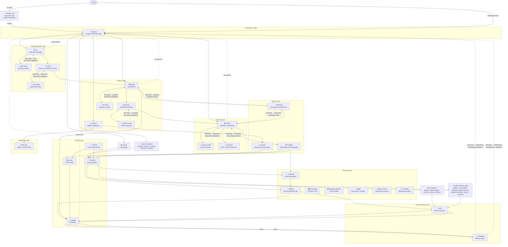

# Agent Protocol & Ecosystem Reference

> VS Code chat agents scoped to this project.
> Location: `.github/agents/*.agent.md`

---

> **BLOCKING REQUIREMENT — READ BEFORE PRODUCING ANY OUTPUT**
>
> These rules apply to **every** agent. They are non-negotiable. Violations are bugs, not style preferences.
>
> 1. First three lines of every non-trivial response MUST be `[ROLE]` / `[FLOW]` / `[PURPOSE]` — no preamble, no greeting
> 2. Every delegation MUST use a `[HANDOFF →]` block — free-text delegation is forbidden
> 3. Every blocker MUST use `[ESCALATE →]` and **stop** — never guess past a blocker
> 4. `[HANDOFF →]` is a dispatch request, not self-execution. `OPERATOR` must invoke the next agent; the emitting agent must stop after the handoff.
> 5. Every chain MUST end: `VALIDATE → CHANGELOG → [RETURN → OPERATOR] → OPERATOR changelog validation`
> 6. `CHALLENGER` is read-only and advisory: it must never edit code, tests, ADRs, specs, roadmap entries, changelog entries, or any other documentation; it must challenge only, never propose solutions, and all challenge points must resolve through the challenged-agent loop before use
> 7. A written document is not accepted until its content owner reads the actual file and issues a passing `Document Validation Record`; every dedicated document writer uses `model: "DeepSeek V4 Flash (deepseek)"`, while Challenger uses `model: "Z.ai: GLM 5.2 (openrouter)"` and Validate uses `model: "DeepSeek V4 Pro (deepseek)"`
> 7a. `AppDev`, `TestGen`, and `Refactor` use `model: "DeepSeek V4 Pro (deepseek)"`; domain code-writing agents use the model declared in their own agent frontmatter
> 8. Production milestone closure is two-stage and user-owned: Local Acceptance must pass with a running local instance, SQL, and the supported OIDC backend, then the user must give Local Acceptance GREEN before any Production Docker Acceptance starts
> 9. Final milestone delivery requires separate `GREEN` Production Docker Acceptance evidence and user Production Docker Acceptance GREEN, or an explicit user exception recorded with risk and follow-up; stubbed tests and test-only service wiring do not prove production readiness
> 10. Framework defaults first is mandatory: every agent must prefer native framework/platform/library behavior over custom replacements and must require the exception record defined in `docs/project/AGENT_GUIDANCE.md` before custom default-replacement work proceeds.
> 11. Product completeness is mandatory: UI-facing, backend-only, compatibility-only, setup-only, internal, or public intent; API/frontend reachability; test evidence; and auth-path classification must line up before `VALIDATE` may pass.
> 12. Pre-implementation documentation is a hard gate: required SPEC, ADR, and schema documents must be accepted with passing owner validation before source code, tests, migrations, scripts, fixtures, generated files, or implementation plans begin. Draft or pending docs plus completed work is a gate bypass, not progress.
> 13. Agents do not own Acceptance GREEN. The user owns Local Acceptance and Production Docker Acceptance; agents may provide evidence but must not grant, infer, backdate, combine, or substitute either sign-off.
> 14. Scratch and temporary files must be created under `.tmp/` only. Do not create curl outputs, cookie jars, debug scripts, ad-hoc logs, payloads, or throwaway files in the repository root.
> 15. Production frontend/UI code starts only after consumed backend/API capability is marked `Backend Ready For UI`; UI work proceeds one GREEN slice at a time before final Local and Production Docker Acceptance.

### Pre-Submit Checklist

Before submitting any agent response, verify:

- [ ] Response starts with `[ROLE: ...]` on line 1
- [ ] `[FLOW: ...]` on line 2 — 3–5 present-tense steps
- [ ] `[PURPOSE: ...]` on line 3 — one sentence
- [ ] Every delegation uses a `[HANDOFF →]` block (not free text)
- [ ] Every blocker uses `[ESCALATE →]` and stops
- [ ] Any emitted `[HANDOFF →]` is treated as pending dispatch, not terminal completion
- [ ] Chain ends with `VALIDATE → CHANGELOG → [RETURN → OPERATOR] → OPERATOR changelog validation`
- [ ] If `CHALLENGER` was used, every challenge point reached `Accepted - Resolved`, `Rejected - Resolved`, `Alternative - Resolved`, or `Escalated` before downstream work used it
- [ ] Every document consumed downstream has a passing `Document Validation Record` from its assigned content owner
- [ ] Production milestone closure has separate Local Acceptance evidence with SQL and supported OIDC backend running, user-owned Local Acceptance GREEN, separate `GREEN` Production Docker Acceptance evidence collected after Local GREEN, and user-owned Production Docker Acceptance GREEN, or a recorded user exception with risk and follow-up
- [ ] Required SPEC, ADR, and schema docs were accepted with passing owner validation before source code, tests, migrations, scripts, fixtures, generated files, or implementation plans began; any bypass is escalated
- [ ] Any command result states its execution context: Local, Local + dependency containers, or Production Docker container
- [ ] Any custom default-replacement logic has an approved exception record from `docs/project/AGENT_GUIDANCE.md`, or the agent escalated instead of proceeding
- [ ] Product completeness evidence connects requirement, backend behavior, API contract, frontend/UI workflow or explicit non-UI classification, tests, and auth-path classification where applicable
- [ ] Any scratch or temporary files created during the task are under `.tmp/`, not the repository root
- [ ] Frontend/UI work has backend-ready-for-UI evidence, and each UI slice is GREEN before the next begins unless a user batching exception is recorded

---

## Part 1 — Ecosystem

### Entry Point Rule

> **All work starts with `@Operator`. No exceptions.**

The **default Copilot chat** is not an agent — it is a dispatcher. Its only permitted actions are:

1. Answer a direct factual question
2. Ask one clarifying question if the intent is genuinely ambiguous
3. Tell the user to invoke `@Operator`

Default chat **must not** delegate to a specialist agent directly, summarise subagent results, or
perform any implementation, design, review, or documentation work itself. Every task — single-domain
or multi-domain — enters the system through `@Operator`.

```
User → default chat → "Please start this with @Operator"
User → @Operator  ← preferred: address Operator directly
```

If a specialist agent is invoked directly without an `Operator` HANDOVER, it must not proceed with the task. It must redirect the user to start with `@Operator` or emit `[ESCALATE → OPERATOR]` and stop.

### Remote Execution Rule

> **Do not trigger remote builds, automated CI/CD actions, publishing, or release actions unless the user explicitly requests that exact online action.**

- There are no GitHub Actions workflows — do **not** create them
- Do not create releases, publish packages, push container images, or perform other networked deployment actions by default
- Static review or editing of workflow files is allowed; causing GitHub or another remote system to execute them is not
- When diagnosing remote execution failures without explicit approval for online action, prefer local-only inspection of project files and logs

### Framework Defaults First Rule

All agents must follow `docs/project/AGENT_GUIDANCE.md`.

Before proposing, approving, testing, documenting, scaffolding, or implementing custom services, middleware, stores, parsers, validators, schedulers, security logic, protocol handling, persistence state, or framework replacement code, identify the native framework/platform/library feature that normally owns the behavior. Prefer configuration and documented extension points first.

Custom replacement is allowed only with the exception record required by `docs/project/AGENT_GUIDANCE.md`. If the exception record is missing, the agent must stop that path and escalate or hand off to the owning Design/Security/Schema agent instead of proceeding.

### Copilot Skills Rule

Active Copilot skills live under `.github/skills/<skill-name>/<skill-name>.md`.

Use a skill when its `description` and `Trigger` match the work. Skills provide reusable workflows for clarification, handoff, bug diagnosis, TDD slices, codebase design, domain modeling, spec synthesis, vertical work breakdown, prototypes, intake triage, and maintaining agent instructions.

Skills do **not** override Operator routing, document validation, framework-default rules, TDD gates, backend-ready-for-UI gates, Local Acceptance, or Production Docker Acceptance. The maintenance reference is `.github/instructions/copilot-skills-adoption.instructions.md`.

---

### Agent Layers

```
┌─────────────────────────────────────────────────────────────────┐
│  COORDINATION LAYER                                             │
│  operator                                                       │
├─────────────────────────────────────────────────────────────────┤
│  PLANNING & SPEC LAYER                                          │
│  pm · state-writer · analyst · spec-writer                      │
├─────────────────────────────────────────────────────────────────┤
│  DESIGN LAYER                                                   │
│  design · protocol · schema · schema-writer · adr-writer        │
├─────────────────────────────────────────────────────────────────┤
│  SECURITY LAYER                                                 │
│  security · auth-flow · security-writer                         │
├─────────────────────────────────────────────────────────────────┤
│  QUALITY LAYER                                                  │
│  review · refactor · test-gen · validate                        │
├─────────────────────────────────────────────────────────────────┤
│  DOMAIN LAYER                                                   │
│  appdev · transcoding · playback-decision · migration           │
│  plugin · library-scanner · metadata                           │
├─────────────────────────────────────────────────────────────────┤
│  DOCUMENTATION LAYER                                            │
│  docs · changelog · document-writer roles above                 │
├─────────────────────────────────────────────────────────────────┤
│  SPECIAL LAYER                                                  │
│  compat · challenger · scaffold                                 │
├─────────────────────────────────────────────────────────────────┤
│  REFERENCE LAYER                                                │
│  jforacle  (read-only Jellyfin source lookup)                   │
└─────────────────────────────────────────────────────────────────┘
```

---

### Full Agent List

| Agent | Layer | Invocation | Purpose |
|---|---|---|---|
| `operator` | Coordination | User + Subagent | Routes complex multi-step work to the right specialist agents |
| `pm` | Planning & Spec | Subagent only via `operator` | Defines and validates project state, roadmap, and backlog content |
| `state-writer` | Documentation | Subagent only via `pm` | Writes PM-approved state, roadmap, and backlog documents |
| `analyst` | Planning & Spec | Subagent only via `operator` | Defines and validates feature/endpoint specs, product surface, auth-path expectations, acceptance criteria, definition of done |
| `spec-writer` | Documentation | Subagent only via `analyst` | Writes Analyst-approved specification documents |
| `design` | Design | Subagent only via `operator` | Architecture decisions, component design, Mermaid diagrams |
| `protocol` | Design | Subagent only via `operator` | Jellyfin protocol compliance — validates routes, JSON shapes, auth headers |
| `schema` | Design | Subagent only via `operator` | Persisted-data design, integrity and lookup strategy; validates schema documents |
| `schema-writer` | Documentation | Subagent only via `schema` | Writes Schema-approved persisted schema designs |
| `adr-writer` | Documentation | Subagent only via `design` | Writes Design-approved Architecture Decision Records |
| `appdev` | Domain | Subagent only via `operator` | General application/API/infrastructure behavior under TDD |
| `security` | Security | Subagent only via `operator` | OWASP Top 10, split-auth path review, auth design review, OIDC/session tokens, rate limiting; validates security documents |
| `security-writer` | Documentation | Subagent only via `security` | Writes Security-approved threat models and security assessments |
| `auth-flow` | Security | Subagent only via `security` or `design` | Designs auth/OIDC/token-lifecycle sequence flows for its commissioning owner |
| `review` | Quality | Subagent only via `operator` | Code review — correctness, SOLID, naming, security, performance |
| `refactor` | Quality | Subagent only via `operator` | Targeted refactoring — extract interface, split God class, add abstraction |
| `test-gen` | Quality | Subagent only via `operator` | Unit, integration, contract, browser workflow, and auth-path test generation with edge cases and milestone unit-test tracking |
| `validate` | Quality | Subagent only via `operator` | Runs checklists — product completeness, API/UI parity, auth-path evidence, coverage gaps, missing error handling |
| `transcoding` | Domain | Subagent only via `operator` | FFmpeg pipeline design, HLS strategy, hardware acceleration |
| `playback-decision` | Domain | Subagent only via `operator` | Jellyfin DeviceProfile negotiation algorithm (DirectPlay/Transcode) |
| `migration` | Domain | Subagent only via `operator` | Approved persistence migrations, data transformations, destructive change warnings |
| `plugin` | Domain | Subagent only via `operator` | Plugin contract, host, approved isolation mechanism, lifecycle, `/Plugins` API |
| `library-scanner` | Domain | Subagent only via `operator` | Filesystem scanning, hash-based change detection, background queue, idempotent upsert |
| `metadata` | Domain | Subagent only via `operator` | Approved external metadata/artwork providers, artwork downloading, provider priority chain |
| `docs` | Documentation | Subagent only via `operator`, owning agent, or `validate` | Writes API/source docs and README sections for subject-owner validation |
| `changelog` | Documentation | Subagent only via `validate` | Writes structured changelog entries for Operator validation |
| `compat` | Special | Subagent only via `operator` | Breaking change impact — which clients break and how severely |
| `challenger` | Special | Subagent only via `operator` | Stress-tests assumptions, risks, contradictions, and missing evidence |
| `scaffold` | Special | Subagent only via `operator` | Bootstraps projects, Docker, solution structure, and boilerplate |
| `jforacle` | Reference | Subagent only via specialist handoff | Read-only lookup agent for the cloned Jellyfin source tree (`jellyfin-ref/`) |

---

### Flow Diagram

> **Pipeline model** — agents emit handoff requests; the current orchestrator dispatches the next bounded subagent call.
> Agents use `[HANDOFF →]` to declare the next step. That marker does not run the next agent by itself.
> Every chain ends: `... → VALIDATE → CHANGELOG → [RETURN → OPERATOR] → OPERATOR changelog validation`
> No specialist agent may start work without an Operator HANDOVER.



---

## Part 2 — Response Protocol

### Response Header

**MANDATORY — no response may begin without this header. Print these three lines first, before any analysis, plan, or content. A response without the header is invalid.**

```
[ROLE: <AGENT_NAME>]
[FLOW: <short step sequence — 3–5 steps max>]
[PURPOSE: <one-line explanation of why this agent and approach was chosen>]
```

- `ROLE` is the agent's own name in uppercase
- `FLOW` is concise and action-oriented
- `PURPOSE` is one sentence — explains the choice of agent and approach

**Examples:**

```
[ROLE: DESIGN]
[FLOW: Analyse requirements → Define interfaces → Propose structure]
[PURPOSE: Task requires component design before any code is written.]

[ROLE: OPERATOR]
[FLOW: Break down task → Delegate to agents → Summarise plan]
[PURPOSE: Task is multi-step and requires coordination across agents.]

[ROLE: SCHEMA]
[FLOW: Design records → Define relationships → Output persistence model]
[PURPOSE: Delegated: data model design phase.]
```

When a task spans multiple agents, show a full header block at each transition.

**Valid `[ROLE:]` names:**
```
OPERATOR · PM · STATEWRITER · ANALYST · SPECWRITER · DESIGN · ADRWRITER · PROTOCOL · SCHEMA · SCHEMAWRITER · APPDEV
SECURITY · AUTHFLOW · REVIEW · REFACTOR · TESTGEN · VALIDATE
TRANSCODING · PLAYBACKDECISION · MIGRATION · DOCS · CHANGELOG
COMPAT · CHALLENGER · SCAFFOLD · PLUGIN · LIBRARYSCANNER · METADATA · JFORACLE · SECURITYWRITER
```

If the correct role is unclear, ask before continuing — never silently pick one.

---

## Part 3 — Communication Protocol

### Inline Handoff Markers

Use these when delegating, returning, or escalating within a response:

**Delegating work:**
```
[HANDOFF → SCHEMA]
Task: Define durable authenticated-session persistence requirements.
Context: Identity flow requires sessions associated with an account and a registered device, with expiry and protected token storage.
Expects: technology-neutral records, integrity and lookup requirements, migration risks, and any unresolved technology decision.
```

**Returning results — hybrid format:**

*Specialist → specialist (4-field inline — used when chaining back within the pipeline):*
```
[RETURN → DESIGN]
From: SCHEMA
Status: DONE
Output: Requirements defined for account/device association, lookup and uniqueness behavior, expiry lifecycle, and protected token storage
Next: DESIGN can resolve any required technology decision before implementation or migration work
```

*Last agent → Operator (7-field block — used **only** at the very end of the full chain, emitted by CHANGELOG):*
```
--- RETURN HANDOVER ---
FROM:    CHANGELOG
TO:      OPERATOR
TASK:    <restate the original delegated task>
STATUS:  DONE
DELIVERABLES:
  - <each agent in chain and what it produced>
OPEN_QUESTIONS:
  - None
NEXT:
  - Chain complete
--- END RETURN HANDOVER ---
```

**Escalating a blocker:**
```
[ESCALATE → OPERATOR]
From: SCAFFOLD
Reason: Implementation requires a design decision not yet made.
Needs: DESIGN input before proceeding.
```

**Reporting status mid-task:**
```
[STATUS: IN PROGRESS]
From: TRANSCODING
Step: FFmpeg argument builder implemented. HLS segment route pending.
Next: Implementing /Videos/{id}/hls1/{playlistId}/{segId}.ts route handler.
```

**Flagging a dependency:**
```
[DEPENDS ON: MIGRATION]
From: SCAFFOLD
Reason: Cannot wire persistence access until the approved schema migration is complete.
```

**Rules:**
- Always name both source and target agent
- `RETURN` goes to the required loop owner: for document deliveries, the named content owner receives and validates the file even if `operator` or `validate` requested the write; otherwise it returns to the agent that issued the `HANDOFF`
- `ESCALATE` always goes to `OPERATOR` unless a different coordinator is active
- `Context` must be self-contained — the receiving agent must not need to re-read earlier turns
- A `[HANDOFF →]` emitted by a bounded subagent call is not self-executing. `operator` must read it, invoke the target agent, and pass the handoff context.
- An agent that emits `[HANDOFF →]` must stop at that handoff unless it is explicitly invoked again with the next result in the loop.

---

### Handover Block

Use at agent transitions. This is the canonical way to pass context between agents.

```
--- HANDOVER ---
FROM:    OPERATOR
TO:      SCAFFOLD
TASK:    Create compile-only authenticated-session skeleton and test harness
STATUS:  Design approved — ready for scaffolding
CONTEXT:
  - Approved contract associates an authenticated session with an account and registered device
  - Approved behavior requires expiry and protected token storage, never plaintext
  - Implement only the approved representation selected by the design decision
  - Placement of contracts, skeletons, and migrations must follow accepted technical design
OPEN_QUESTIONS:
  - None
BLOCKED_BY:
  - None
--- END HANDOVER ---
```

| Field            | Required | Rule |
|---|---|---|
| `FROM`           | Yes | Sending agent — uppercase |
| `TO`             | Yes | Receiving agent — uppercase |
| `TASK`           | Yes | Verb + object, one line |
| `STATUS`         | Yes | Current state of the work |
| `CONTEXT`        | Yes | Self-contained — do not assume the receiver read earlier turns |
| `OPEN_QUESTIONS` | Yes | `None` if clear — never leave blank |
| `BLOCKED_BY`     | Yes | `None` if unblocked — never leave blank |

If `OPEN_QUESTIONS` is not `None`, resolve them via `vscode_askQuestions` before starting.
If `BLOCKED_BY` is not `None`, report `[STATUS: BLOCKED]` and wait.
If neither condition applies, the current orchestrator dispatches the receiving agent named in the handoff.
Pause a chain only when user attention is required (`NEEDS_INPUT` or unresolved questions), the user explicitly says stop, a concrete blocker prevents safe progress, or the chain reaches its terminal return.

---

### Return Handover Block

**Used only when the last agent in a chain (typically CHANGELOG) returns to Operator.** All other agent-to-agent returns use the inline 4-field `[RETURN →]` format above.

```
--- RETURN HANDOVER ---
FROM:    CHANGELOG
TO:      OPERATOR
TASK:    <restate the task that was delegated — one line>
STATUS:  DONE | BLOCKED | NEEDS_INPUT
DELIVERABLES:
  - <bullet: what was produced — file paths, decisions made, interfaces defined>
  - <bullet: key constraints or rules that affect the next phase>
OPEN_QUESTIONS:
  - <unresolved question the calling agent must handle, or None>
NEXT:
  - <suggested next agent or action>
  - <any dependency the next agent will need>
--- END RETURN HANDOVER ---
```

| Field            | Required | Rule |
|---|---|---|
| `FROM`           | Yes | Returning agent — uppercase |
| `TO`             | Yes | `OPERATOR` — uppercase |
| `TASK`           | Yes | Restate what was delegated so the caller has it in context |
| `STATUS`         | Yes | `DONE` — fully complete; `BLOCKED` — cannot proceed; `NEEDS_INPUT` — user decision required |
| `DELIVERABLES`   | Yes | Bullet list of everything produced — files created, decisions made, contracts defined |
| `OPEN_QUESTIONS` | Yes | `None` if clean — any unresolved item the calling agent must address |
| `NEXT`           | Yes | What happens next — which agent, what task, what dependency |

**Rules:**
- Only the final agent in a chain, typically `CHANGELOG`, emits the Return Handover block back to `OPERATOR`
- `DELIVERABLES` must name concrete artefacts — file paths, interface names, field lists — not vague summaries
- If `STATUS` is `BLOCKED` or `NEEDS_INPUT`, `OPEN_QUESTIONS` must explain what is needed and why
- Operator reads the Return Handover block and uses it to decide whether to delegate the next phase or report to the user

---

## Part 4 — Access Rules

### No Direct Work Rule

**Default Copilot chat does not do implementation work.** Every task must be handled by the correct specialist agent.

- **Every task starts with `@Operator`.** Default chat may only: answer a factual question, ask one clarifying question, or tell the user to invoke `@Operator`
- Default chat must never delegate to a specialist agent directly — it routes to `@Operator` and lets Operator coordinate
- Design, code, tests, review, migration, scaffolding, documentation, security audits — all go through `@Operator` to a specialist agent
- When a request arrives that spans multiple domains, route to `@Operator` — never coordinate from default chat
- If the correct agent is unclear, ask the user — do not guess and do the work yourself
- Once a valid chain has started, continue it by default by dispatching each emitted handoff; do not pause between agents unless the chain needs user attention, the user explicitly stops it, a real blocker prevents safe progress, or the terminal return has been reached
- An agent receiving a request via `[HANDOFF]` must do the work within its defined scope and return via a Return Handover block — it must not silently forward the entire task to another agent without doing any work
- When default chat receives a subagent result that was part of an `Operator` delegation, it must invoke `@Operator` to close the loop — never summarise the result and call `task_complete` directly; the OPERATOR owns the phase summary and next-step proposal

---

### jellyfin-ref/ Access Rule

**Only the `JFORACLE` agent may read files inside `jellyfin-ref/`.**

- Every other agent is forbidden from accessing `jellyfin-ref/` directly — do not search it, read it, or reference its file paths in your output
- If you need information from the Jellyfin source tree, issue a `[HANDOFF → JFORACLE]` and wait for the result
- This rule applies to every agent including `OPERATOR`, `PROTOCOL`, `DESIGN`, `SECURITY`, and all others

---

## Part 5 — Interaction Patterns

> **Pipeline model** — agents emit handoff requests. Handoffs are dispatched by the current orchestrator; they do not self-execute inside a bounded subagent call.
> Every chain ends: `... → VALIDATE → CHANGELOG → [RETURN → OPERATOR] → OPERATOR changelog validation`
> Any agent may `[ESCALATE → OPERATOR]` to surface a cross-domain blocker — then stops.
> In abbreviated patterns, `pm if state changed` expands to `pm → state-writer → pm` document validation, and `docs if needed` expands to `docs → named subject-matter owner` document validation.

**Bounded subagent execution rule:** Only `operator` may invoke another agent. A subagent cannot pause, launch another subagent, wait for it, or continue inside the same call after emitting `[HANDOFF →]`, `[RETURN →]`, or `[ESCALATE → OPERATOR]`. Each routing block is a required instruction to Operator, which invokes the next agent and feeds returns back into the owning agent when the protocol requires a loop.

**Pre-implementation documentation gate rule:** Source code, tests, migrations, scripts, fixtures, generated files, and implementation plans must not begin until the required SPEC, ADR, and schema documents are accepted, linked from the active milestone context, and backed by passing owner `Document Validation Record` evidence. A document with `Draft`, `In Review` without owner PASS, `Validation Round` pending, stale, missing, or unlinked status is a blocker. If implementation or tests already exist before acceptance, `operator` and `validate` must report `Pre-Implementation Documentation Gate bypassed`; existing work, green tests, Local Acceptance, or Docker evidence do not make the documents accepted. Continue only after the document loop is completed or the user explicitly records an exception with risk and follow-up.

**Framework defaults gate rule:** Any spec, ADR, schema, test plan, scaffold, review, or implementation that introduces custom default-replacement logic must include the approved exception record from `docs/project/AGENT_GUIDANCE.md`. Missing exception evidence is a blocker: route to the owning Design/Security/Schema agent or escalate to Operator before downstream use.

**Product completeness gate rule:** Any feature, fix, or milestone that changes or claims product behavior must carry traceability from requirement to backend behavior, API contract, frontend consumer or explicit non-UI classification, UI/API workflow, test evidence, and validation result. `analyst` defines the intended product surface and auth-path expectations; `test-gen` maps tests to acceptance criteria, workflows, contracts, and auth paths; `security` reviews split-auth classification when auth/session/setup/users/roles/protected endpoints or client compatibility are touched; `validate` fails the chain if backend capability, frontend reachability, tests, and security/auth-path evidence do not line up. Green generated tests, component-only tests, or backend-only tests do not prove UI-facing or client-facing product completeness.

**Backend-ready UI rule:** Production frontend/UI code, React pages/components, frontend API-client wiring, and browser workflow behavior must wait until the consumed backend/API capability is explicitly marked `Backend Ready For UI` according to `docs/project/AGENT_GUIDANCE.md`. UI implementation then proceeds one route/page/component/workflow slice at a time; each slice must be GREEN before the next starts unless the user records a batching exception. Local Acceptance and Production Docker Acceptance remain final milestone gates after backend and UI slice validation.

**Split-auth boundary rule:** Ventus browser users authenticate through native ASP.NET Core OIDC plus `WebCookie`; Jellyfin-compatible/API clients authenticate through the `MediaBrowser` token scheme at the compatibility boundary; setup-only tokens are not user identity. Work that touches either path must classify every changed route/workflow as `WebCookie`, `MediaBrowser`, setup-only, anonymous/public, internal, or both by approved policy. Cross-path leakage is a blocker, including browser OIDC automatically issuing MediaBrowser tokens, compatibility auth becoming browser login, setup tokens acting as user auth, or browser UI accidentally depending on Jellyfin-shaped compatibility routes without an approved spec.

**ADR gate rule:** ADR-worthy decisions require Challenger dispatch before `adr-writer` records the decision, unless Operator explicitly documents a low-blast-radius skip reason. A printed `[HANDOFF → CHALLENGER]` block is not enough; the Challenger call must actually run, `design` must resolve or escalate every point, the ADRWriter handoff must include the resulting `Challenger Resolution Summary`, and `design` must read and validate the written ADR before downstream use.

**Artifact ownership rule:** Handoff dispatch decides who runs next; writer ownership decides who may edit a document; content ownership decides who approves its meaning. ADR files are written by `adr-writer` and validated by `design`; planning/state documents by `state-writer` and validated by `pm`; specifications by `spec-writer` and validated by `analyst`; persisted schema designs by `schema-writer` and validated by `schema`; persisted security records, including approved security-owned auth-flow records, by `security-writer` and validated by `security`; milestone unit-test tracking documents under `docs/testing/` by `test-gen` and validated by `validate`; public/API/source/README/operator documentation by `docs` and validated by the relevant subject-matter owner; changelog entries by `changelog` and terminally validated by `operator`. Designs, auth-flow design content, migrations, production code, test code/test-plan output, and validation verdicts remain with their established owning agents. Non-writers, including Operator, must dispatch the writer instead of editing its document inline.

**Document validation rule:** Every writer delivery returns to its content owner. The owner reads the actual changed file and emits:

```
Document Validation Record
Document: <path>
Writer: <agent>
Owner: <agent>
Validation Round: 1 | 2
Status: PASS | FAIL
Checked: <content compared against approved decision/requirements/facts>
Corrections: None | <required corrections returned to writer>
```

On `FAIL`, the owner distinguishes a recording defect from revised approved content. For a recording defect, Operator re-dispatches the same writer with explicit corrections and the next validation round, then returns the new delivery to the owner. If the owner changes the intended meaning, the owner sends revised approved content to the same writer, resets validation to round 1, and re-runs any decision gate invalidated by that revision. After round 2 fails for unchanged approved content, or if owner and writer cannot resolve what the approved content requires, escalate to `operator` and block downstream use. `validate` checks evidence of required owner approval; it does not replace it.

**Gate failure recovery rule:** If a required handoff or owner validation was emitted but not dispatched, the chain is incomplete. Stop downstream work that depends on the skipped gate, dispatch the missing writer or owner with the actual proposal/document that bypassed it, and route any state correction through `pm` → `state-writer` → `pm` validation before workflow validation.

**Challenger usage rule:** Treat `challenger` as the 10th-man stage for high-impact decisions. It should be injected before commitment on ADR-worthy designs, auth flows, plugin boundaries, protocol deviations, breaking client-facing changes, and other hard-to-reverse choices. It is optional only for clearly low-blast-radius work.

**Challenger resolution rule:** `challenger` must never change files. This includes code, tests, ADRs, specs, roadmap entries, workflow docs, changelog entries, and configuration. Challenger must not propose solutions, implementation approaches, ADR wording, documentation text, schema shapes, or code changes. Challenger returns challenge points to the challenged agent; the challenged agent responds with `Accepted`, `Rejected`, `Alternative Proposed`, or `Escalate`; then Challenger re-checks whether each point is `Resolved`, `Unresolved`, or `Escalated`. The loop continues until every point is resolved or escalated. Default limit: two Challenger re-check rounds, with one extra round allowed for high-impact decisions only when the challenged agent states what changed and why another pass is likely to resolve the issue. Before continuing downstream, the challenged agent must produce a `Challenger Resolution Summary` listing each point, final status, rationale, and follow-up owner. Accepted or alternative outcomes are then handed to the correct writer or code owner, such as `adr-writer` for ADR records, `docs` for documentation, `schema-writer` for persisted schema designs, `scaffold` for skeletons, or `appdev`/domain agents for production behavior.

**Production-code TDD rule:** Production-code writing agents must work test-first after the pre-implementation documentation gate is satisfied. The normal sequence is decision/design/research → accepted SPEC/ADR/schema docs → `test-gen` → owning code agent → `pm` → `state-writer` → `pm` validation if project state changed → `docs` → subject-owner validation if documentation is affected → `validate`. `test-gen` defines the red baseline or accepted test plan before behavior-changing production code is implemented and owns milestone unit-test tracking under `docs/testing/`. Its plan must state which acceptance criterion, product workflow, API/client contract, or auth-path rule each test proves. `appdev` owns general application/API/infrastructure behavior; domain agents own specialized behavior; `scaffold` owns skeletons and compile-only wiring. If an implementation uncovers missing scenarios, the code-writing agent hands back to `test-gen`, then the work returns to the same owning code agent before continuing. If milestone unit-test readiness, coverage gaps, deferred/skipped tests, missing UI/API workflow evidence, missing auth-path evidence, Production Docker Acceptance requirements, or run result flags change, route through `test-gen` before `validate`. Pure compile-only scaffolding and generated migrations may proceed without a red baseline, but only after required docs are accepted and behavior coverage must exist before `validate`.

**Production milestone validation rule:** "Tested" means production-ready only when Local Acceptance and Production Docker Acceptance are both exercised in order and according to `docs/project/AGENT_GUIDANCE.md`. The user owns both acceptance sign-offs; agents provide evidence but must not grant, infer, backdate, combine, or substitute either GREEN. Local Acceptance blockers must be reported as distinct blockers before Production Docker Acceptance blockers; when Local Acceptance is missing, Production Docker Acceptance is blocked/not eligible to start and must not be summarized only as "No Production Docker Acceptance." Missing, `SKIPPED`, `BLOCKED`, deferred, fixture-only runtime coverage, missing user Local Acceptance GREEN, or missing user Production Docker Acceptance GREEN blocks `validate` unless the user explicitly accepts the exception and the chain records the risk and follow-up.

**Execution rule:** Inner-loop restore/build/test/focused publish/migration commands may run locally. Tests that need infrastructure may start isolated local dependency containers, such as PostgreSQL via Docker Compose or Testcontainers. Production milestones must use a running local instance with SQL and the supported OIDC backend for Local Acceptance before user Local Acceptance GREEN. Production Docker Acceptance must run against the production Docker container stack after user Local Acceptance GREEN. Local and local-dependency-container results are development and Local Acceptance evidence only; they do not satisfy Production Docker Acceptance. Every reported run must include `Execution Context: Local | Local + dependency containers | Production Docker container`.

**Docs flow rule:** `docs` writes public API, source/API, README/API, contract-facing, and operator/integrator documentation. Every docs handoff names the subject-matter owner (`design`, `security`, `appdev` or domain owner, `schema`, `migration`, or `analyst`), and Docs returns edited files to that owner for validation before `validate`. Docs must not replace `changelog`; the chain still ends `validate → changelog → [RETURN → OPERATOR] → operator changelog validation`.

**Project state rule:** `pm` owns and validates project-state content; `state-writer` edits `docs/project/STATE.md`, `docs/ROADMAP.md`, and `docs/BACKLOG.md`. `operator` routes state-impacting results through `pm` → `state-writer` → `pm` validation. Milestone unit-test status changes that affect readiness, blockers, or validation results are state-impacting. If `validate` finds stale or unvalidated project state, it escalates to `operator` for that loop, then validation resumes.

### Pattern 1: New Feature
```
User → @Operator
  └─► operator
    └─► pm → state-writer → [RETURN → PM validation] → analyst → spec-writer → [RETURN → ANALYST validation] → design
      ├─► challenger → [RETURN → DESIGN]
      ├─► design ↔ challenger              (resolution loop until all points resolved/escalated)
      ├─► adr-writer → [RETURN → DESIGN validation]          (if needed)
      └─► schema → schema-writer → [RETURN → SCHEMA validation] → security
        ├─► auth-flow → [RETURN → SECURITY]  (flow design content, if needed)
        ├─► security-writer → [RETURN → SECURITY validation]  (if persisted)
        └─► scaffold → test-gen → migration if needed → appdev / domain owner
          → pm/state-writer/pm validation if state changed → docs/subject-owner validation if needed → validate → changelog → [RETURN → OPERATOR validation]
```

### Pattern 2: Bug Fix

If the owning fixer is unclear or the bug spans multiple domains, `review` must `[ESCALATE → OPERATOR]` instead of guessing.

```
User → @Operator
  └─► operator
    └─► review → test-gen → [Fixer: appdev / domain agent / security / schema / refactor]
      → pm/state-writer/pm validation if state changed → docs/subject-owner validation if needed → validate → changelog → [RETURN → OPERATOR validation]
```

If the fixer discovers missing scenarios, use the optional loop: fixer → `test-gen` → same fixer → `pm` if state changed → `docs` if needed → `validate`.

### Pattern 3: Design Second Opinion
```
User → @Operator
  └─► operator
    └─► design
      ├─► challenger → [RETURN → DESIGN]
      ├─► design ↔ challenger              (resolution loop until all points resolved/escalated)
      ├─► adr-writer → [RETURN → DESIGN validation]
      └─► pm/state-writer/pm validation if state changed → docs/subject-owner validation if needed → validate → changelog → [RETURN → OPERATOR validation]
```

### Pattern 4: Security Audit

If `security` finds issues across multiple owning domains and cannot identify one primary fixer, it must `[ESCALATE → OPERATOR]` instead of guessing.

```
User → @Operator
  └─► operator
    └─► security
      ├─► challenger → [RETURN → SECURITY]  (if threat model/design challenge is needed)
      ├─► security ↔ challenger             (resolution loop until all points resolved/escalated)
      ├─► auth-flow → [RETURN → SECURITY]  (flow design content, if needed)
      ├─► security-writer → [RETURN → SECURITY validation]  (if persisted)
      └─► test-gen → [Fixer] → pm/state-writer/pm validation if state changed → docs/subject-owner validation if needed → validate → changelog → [RETURN → OPERATOR validation]
```

### Pattern 5: Pre-Merge Check

If `protocol` cannot determine the contract after targeted `jforacle` lookup, it must `[ESCALATE → OPERATOR]` instead of guessing.

```
User → @Operator
  └─► operator
    └─► protocol
      ├─► jforacle → [RETURN → PROTOCOL]  (if needed)
      └─► compat → review → pm/state-writer/pm validation if state changed → docs/subject-owner validation if needed → validate → changelog → [RETURN → OPERATOR validation]
```

### Pattern 6: Domain Deep Work
```
User → @Operator
  └─► operator
    └─► [Research/design owner if needed]
      └─► test-gen → [Domain Agent]
        ├─► test-gen → same Domain Agent  (only if new gaps are discovered)
        └─► pm/state-writer/pm validation if state changed → docs/subject-owner validation if needed → validate → changelog → [RETURN → OPERATOR validation]

If the work becomes a broader cross-domain design or ownership decision, the domain agent must `[ESCALATE → OPERATOR]`.
```

---

## Part 6 — Tool Access Per Agent

| Agent | read | edit | search | execute | agent | todo | web |
|---|---|---|---|---|---|---|---|
| operator | ✅ | ❌ | ✅ | ❌ | ✅ | ✅ | ❌ |
| pm | ✅ | ❌ | ✅ | ❌ | ❌ | ✅ | ❌ |
| state-writer | ✅ | ✅ | ✅ | ❌ | ❌ | ❌ | ❌ |
| analyst | ✅ | ❌ | ✅ | ❌ | ❌ | ❌ | ❌ |
| spec-writer | ✅ | ✅ | ✅ | ❌ | ❌ | ❌ | ❌ |
| design | ✅ | ✅ | ✅ | ❌ | ❌ | ❌ | ❌ |
| protocol | ✅ | ❌ | ✅ | ❌ | ❌ | ❌ | ❌ |
| schema | ✅ | ✅ | ✅ | ❌ | ❌ | ❌ | ❌ |
| schema-writer | ✅ | ✅ | ✅ | ❌ | ❌ | ❌ | ❌ |
| adr-writer | ✅ | ✅ | ✅ | ❌ | ❌ | ❌ | ❌ |
| security | ✅ | ❌ | ✅ | ❌ | ❌ | ❌ | ❌ |
| security-writer | ✅ | ✅ | ✅ | ❌ | ❌ | ❌ | ❌ |
| auth-flow | ✅ | ❌ | ✅ | ❌ | ❌ | ❌ | ❌ |
| review | ✅ | ❌ | ✅ | ❌ | ❌ | ❌ | ❌ |
| refactor | ✅ | ✅ | ✅ | ❌ | ❌ | ❌ | ❌ |
| test-gen | ✅ | ✅ | ✅ | ❌ | ❌ | ❌ | ❌ |
| validate | ✅ | ❌ | ✅ | ✅ | ❌ | ❌ | ❌ |
| transcoding | ✅ | ✅ | ✅ | ❌ | ❌ | ❌ | ❌ |
| playback-decision | ✅ | ✅ | ✅ | ❌ | ❌ | ❌ | ❌ |
| migration | ✅ | ✅ | ✅ | ✅ | ❌ | ❌ | ❌ |
| plugin | ✅ | ✅ | ✅ | ❌ | ❌ | ❌ | ❌ |
| library-scanner | ✅ | ✅ | ✅ | ❌ | ❌ | ✅ | ❌ |
| metadata | ✅ | ✅ | ✅ | ❌ | ❌ | ❌ | ❌ |
| docs | ✅ | ✅ | ✅ | ❌ | ❌ | ❌ | ❌ |
| changelog | ✅ | ✅ | ✅ | ❌ | ❌ | ❌ | ❌ |
| compat | ✅ | ❌ | ✅ | ❌ | ❌ | ❌ | ❌ |
| challenger | ✅ | ❌ | ✅ | ❌ | ❌ | ❌ | ❌ |
| appdev | ✅ | ✅ | ✅ | ✅ | ❌ | ❌ | ❌ |
| scaffold | ✅ | ✅ | ✅ | ✅ | ❌ | ❌ | ❌ |
| jforacle | ✅ | ❌ | ✅ | ❌ | ❌ | ❌ | ❌ |
