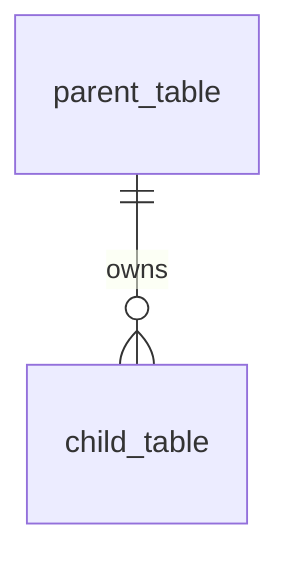

# <Feature Or Domain> Schema <version>

| Field | Value |
| --- | --- |
| Status | Draft |
| Date | YYYY-MM-DD |
| Owner | @Schema |
| Writer | @SchemaWriter |
| Spec | SPEC-xxx |
| ADRs | ADR-xxx |
| Migration | Pending |

Allowed status values: `Draft`, `In Review`, `Accepted`, `Superseded`.

## Pre-Implementation Gate

This schema document must be accepted with a passing Schema `Document Validation Record` before EF models, migrations, indexes, constraints, repositories, fixtures, generated files, implementation plans, or storage code are created. Do not implement storage first and backfill this schema later.

## Scope

Describe the persisted data boundary covered by this schema document.

Include:
- Features, stories, or capabilities covered.
- Tables, records, or persisted concepts in scope.
- Tables, records, or persisted concepts explicitly out of scope.

## Design Inputs

List the approved sources that constrain this schema.

| Source | Relevance |
| --- | --- |
| SPEC-xxx | Requirement or behavior summary |
| ADR-xxx | Technical or architectural constraint |
| Other | Additional accepted design input |

## Framework Defaults First

This schema must follow [Agent Guidance: Framework Defaults First](../project/AGENT_GUIDANCE.md).

Do not introduce tables, stores, queues, locks, correlation records, or persisted state for behavior owned by framework middleware, platform infrastructure, or mature libraries unless the active spec or ADR contains an approved custom implementation exception.

If this schema requires such persisted state, reference the approved exception and summarize why durable Ventus-owned data is required:

| Field | Required Content |
| --- | --- |
| Requirement | Current requirement that needs Ventus-owned persisted state |
| Default considered | Framework, platform, or library state mechanism normally responsible |
| Gap | Exact behavior the default cannot provide |
| Custom boundary | Smallest persisted model/store required |
| Risk | Security, reliability, operability, migration, and cleanup risk added |
| Tests | Schema, migration, concurrency, and cleanup tests required |
| Owner approval | Schema owner, Design, and required domain reviewers |

## Access Patterns

Describe the read and write paths that justify the schema shape and indexes.

| Access Pattern | Frequency | Tables | Required Ordering / Filtering | Notes |
| --- | --- | --- | --- | --- |
| Example lookup | High / Medium / Low | table_name | column_name | Why this path matters |

## Entity Relationship Diagram

## Relationship Summary

Use this table as a plain-text fallback for the ERD.

| From | To | Cardinality | Required | Delete Behavior | Notes |
| --- | --- | --- | --- | --- | --- |
| parent_table | child_table | 1:N | Yes | Restrict / Cascade / Set null | Relationship purpose |

## Table 1: <table_name>

### Purpose

Describe what this table stores and why it exists.

### Columns

| Column | Type | Nullable | Default | Definition Notes |
| --- | --- | --- | --- | --- |
| id | uuid | No | gen_random_uuid() | Primary key |

### Constraints

| Kind | Name | Definition |
| --- | --- | --- |
| Check | chk_table_column_rule | Constraint expression |

### Foreign Keys

| Name | Definition |
| --- | --- |
| fk_child_parent | parent_id -> parent_table(id) ON DELETE RESTRICT |

If none, write `None.`

### Unique Constraints

| Name | Definition |
| --- | --- |
| uq_table_column | UNIQUE (column_name) |

If none, write `None.`

### Indexes

| Name | Definition | Justification |
| --- | --- | --- |
| pk_table_name | PRIMARY KEY (id) | Canonical row identity |

### Column Notes

| Column | Note |
| --- | --- |
| column_name | Storage, privacy, compatibility, or migration note |

If none, write `None.`

### Lifecycle And Delete Behavior

Describe creation, update, soft-delete, hard-delete, archival, and cleanup behavior for this table.

## Referential Integrity Summary

Summarize cross-table integrity rules that matter to migrations, deletion, recovery, or application behavior.

| Rule | Tables | Enforcement | Notes |
| --- | --- | --- | --- |
| Example integrity rule | parent_table, child_table | FK / unique / check / application | Why this rule exists |

## Index Strategy Summary

Summarize all non-primary indexes and why each one exists. Do not include indexes without an access-pattern justification.

| Index | Table | Columns | Access Pattern | Notes |
| --- | --- | --- | --- | --- |
| idx_table_column | table_name | column_name | Example lookup | Justification |

## Migration Plan

Describe migration impact and ordering.

| Step | Operation | Impact | Rollback / Recovery |
| --- | --- | --- | --- |
| 1 | Create or alter table | Additive / destructive / data migration | Rollback or recovery plan |

## Migration Order

List the intended migration order when multiple tables, constraints, indexes, or data transforms are involved.

1. Create parent tables.
2. Create child tables.
3. Add constraints and indexes.
4. Backfill or transform data if required.

## Data Retention And Cleanup

Describe retention requirements, cleanup jobs, audit needs, and backup/restore considerations.

## Security And Privacy Notes

Describe sensitive fields, token/secret handling, encryption or hashing requirements, audit implications, and data exposure risks.

## Technology Notes

Describe provider-specific implications only when the persistence technology has already been approved.

If the design is technology-neutral, state that explicitly.

## Open Questions

- Question 1.
- Question 2.

## Validation Record

Document Validation Record
Document: docs/schema/<file-name>.md
Writer: @SchemaWriter
Owner: @Schema
Validation Round: 1
Status: PASS / FAIL
Checked:
- Schema document records the approved persisted data model.
- Relationships, indexes, constraints, and migration impact match @Schema approved content.
Corrections: None
